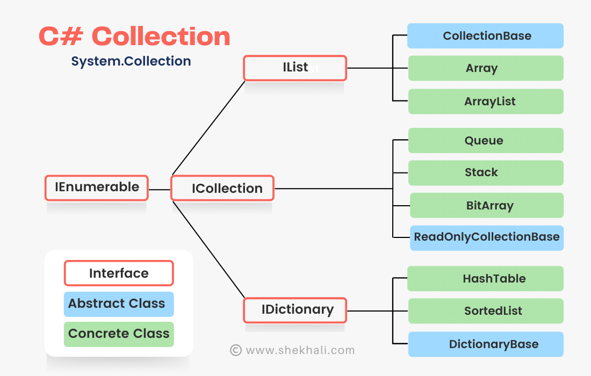

# Resume Builder API

This repo is created to learn about:

- how to build a WebAPI in C#
- API versioning
- Single sign on
- Authentication
- Authorisation
- Testing
- [Documenting API](https://apiguide.readthedocs.io/en/latest/build_and_publish/documentation.html)

- Resume builder concept is used to build the API.

The resume builder API enables the users to select the resume template and add relevant sections such as personal details, education, work experience, tech stack, etc.

## Concepts & Terminologies

- [ActionResult types represent various HTTP status codes.](https://docs.microsoft.com/en-us/aspnet/core/web-api/action-return-types?view=aspnetcore-6.0)

- [AJAX partial page load or update](https://www.youtube.com/watch?v=ZRt1qtt8ps0)

  - [What is AJAX?](https://www.c-sharpcorner.com/article/ajax-in-asp-net/)
    - Asynchronous JavaScript and XML (AJAX) is a development technique used to create interactive web applications or rich internet applications. AJAX uses a number of existing technologies together, including: XHTML, CSS, JavaScript, Document Object Model, XML, XSLT, and the XMLHttpRequest object.
    - With AJAX, web applications can retrieve data from the server asynchronously, in the background, without reloading the entire browser page. The use of AJAX has led to an increase in interactive animation on web pages.

- [C# Collection](https://www.shekhali.com/collections-in-csharp/)

  - 

- [C# comparison](https://www.codeproject.com/Articles/832189/List-vs-IEnumerable-vs-IQueryable-vs-ICollection-v)
  - 
- [Command Query Responsibility Segregation](https://hadoan.medium.com/hello-cqrs-pattern-with-c-ff71bfaa6cf)

  - [CQRS](https://docs.microsoft.com/en-us/azure/architecture/patterns/cqrs) stands for Command and Query Responsibility Segregation, a pattern that separates read and update operations for a data store. Implementing CQRS in your application can maximize its performance, scalability, and security. The flexibility created by migrating to CQRS allows a system to better evolve over time and prevents update commands from causing merge conflicts at the domain level.
  - 

    - [Image sourced from chandradev819.wordpress](https://chandradev819.wordpress.com/category/c/)

- [IEnumerable-ICollection-IList](https://www.claudiobernasconi.ch/2013/07/22/when-to-use-ienumerable-icollection-ilist-and-list/)
  - 
- REST Architecture
  - Each service will be treated as a resource.
    - User registration
    - Admin registration
    - Template
      - How to generate
    - User profile
    - Tech stack
    - Education
    - Certification
    - References
  - User can access using HTTP protocol.
  - Send request to server
  - According to the request
  - CRUD operations
  - Authentication
  - Identity Server : Single sign on
- RESTful API
  - Client and Server are decoupled to each other.
  - Light weight compared to SOAP based service
- [Routing : default vs attribute](https://docs.microsoft.com/en-us/aspnet/web-api/overview/web-api-routing-and-actions/attribute-routing-in-web-api-2) 
  - Routing is how Web API matches a URI to an action. Web API 2 supports a new type of routing, called attribute routing. As the name implies, attribute routing uses attributes to define routes. Attribute routing gives you more control over the URIs in your web API.
  - [Convention Routing VS Attribute Routing](https://www.c-sharpcorner.com/article/convention-routing-vs-attribute-routing/)

- [URI vs URL vs URN vs endpoint](https://danielmiessler.com/study/difference-between-uri-url/)

  - 
  - 
  - URI - a string of characters that uniquely identify a name or a resource on the internet
    - URI identifies a resource by name, location, or both. URIs have two specializations known as Uniform Resource Locator (URL), and Uniform Resource Name (URI).
    - URL - A Uniform Resource Locator (URL) is a type of URI that specifies not only a resource, but how to reach it on the internet—like http://, ftp://, or mailto://.
  - URN - A Uniform Resource Name (URN) is a type of URI that uses the specific naming scheme of urn:—like urn:isbn:0-486-27557-4 or urn:isbn:0-395-36341-1.
    - URI or URN is like your name
    - a URL is a specific subtype of URI that’s like your name combined with your address.
  - [Endpoint](https://rapidapi.com/blog/api-glossary/endpoint/)

    - 

      - Image sourced from [wallarm](https://www.wallarm.com/what/api-endpoint)

    - an API endpoint is the point of entry in a communication channel when two systems are interacting. It refers to touchpoints of the communication between an API and a server. The endpoint can be viewed as the means from which the API can access the resources they need from a server to perform their task. An API endpoint is basically a fancy word for a URL of a server or service.
    - We all know that APIs operate through ‘requests’ and ‘responses.’ And when an API requests to access data from a web application or server, a response is always sent back. The location where the API sends a request and where the response emanates is what is known as an endpoint. Reputedly, the endpoint is the most crucial part of the API documentation since it’s what the developer will implement to make their requests.

  - 

- Clean architecture : middle level is domain
  - Monolithic: Presentation, Business Logic (Application), Database
  - N-layer Architecture
    - total number of layers ==> N 
  - Microservices - loosely 
- Tier means physical machine
  - Three layer applications and deploy it into one machine 
  - Two tiers in two machines 
    - Layers for separating each layer has their own responsibility 
  - DOMAIN centric architecture (Onion architecture) is a sub category of clean architecture  
    - Domain layer - Domain driver design, business entity
      - Entity can be objects with methods 
    - Application layer - Application specific business layer 
    - Presentation layer - 
      - UI
      - Infrastructure - e.g. Entity framework core, mysql 

- WebAPI is presentation layer.
- Domain Resume builder 
  - Entities => table 
  - [My Perfect Resume](https://www.myperfectresume.com/build-resume/section/cntc)
  - Business entitiies only in the Domain. Entity framework will not be in this folder to apply clean code 
  - Persistence folder => will help to connect with DB

- Code First approach will be used to make this app.
- ToDo list 
    - Make a class diagram : UML diagram 
    - UserProfile
    - Education 

- Dependencies => Add project reference 

- ***What is Generic class?*** It decouple from data type.
  - General class 
  - closed the modification

  ```
  class UserProfile <T> {
    public T MobileNumber {get; set;}
  }

  UserProfile sam = new UserProfile<int>();
  same.MobileNumber = 123456;

  UserProfile waqas = new UserProfile<string>();
  waqas.MobileNumber = "1237989";

  ```
  - ctrl + . => implement interface.
  - always implement the interface 
- CQRS - in Application 
  - Fetch query : Read 
  - Command query will be created : Add, Update, Delete
- Application DB
- Constructor types - ToDo
  - parameterised 
  ```
    class Person {
      //Fields 
      private string Name;
      private string Country;

      public Person(string name, string country){
        Name = name;
        Country = this.country;
      }
    }

    Person p1 = new Person()

  ```

- [DbContext](https://github.com/ktSuW/AvaRent/blob/main/AvaRent.Data/AvaRentDbContext.cs)